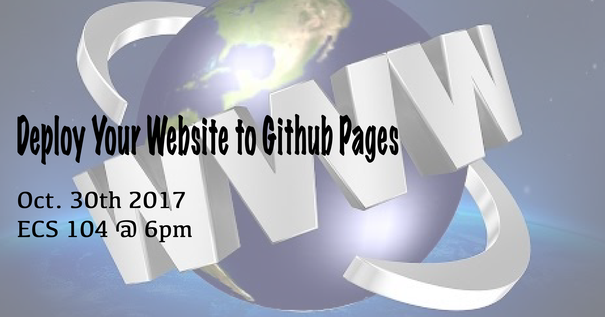

# Deploy To Github Pages

UVic WebDev Club Workshop on how to deploy to github pages.

## Learning Outcomes

* Create a Github Repository.
* Install and Navigate git through the terminal.
* Become familiar with deploying to github pages.

## Workshop Outline

* Introduction
* Workshop
* Conclusion

## How to Prepare

Please Bring the following:

* Computer / Charger
* Note Pad and Pencil

Please have access to:

* The Bash Terminal

## Requirements

* [Github Account](https://github.com/join)
* Admin Access to your Computer
* Basic Computer Skills (Keyboard / Mouse / Search)

## Links

* [Presentation Slides](./presentation/GithubPagesWorkshop-UVicWebDevClub.pdf)
* [Demo Files](./demo-files)

## Resources

* https://github.com/join
* https://pages.github.com/
* http://git-scm.com/download/

## References

* https://git-scm.com/book/en/v2/Getting-Started-Installing-Git
* https://i.ytimg.com/vi/ikMrTj_dhWM/hqdefault.jpg
